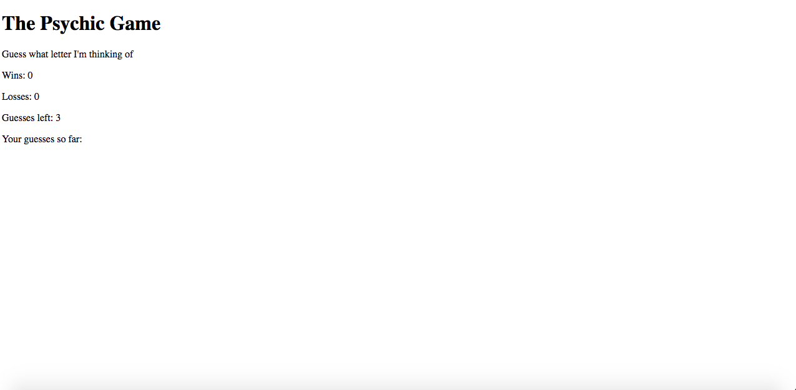

# Psychic-Game

## Overview

In this homework assignment for Rutgers Coding Bootcamp, students were asked to create one of two possible computer games: Word Guess or Psychic. These apps will run in the browser, and feature dynamically updated HTML and CSS powered by JavaScript code.

This is the Psychic version, which has an app that randomly picks a letter, and the user has to guess which letter the app chose.

## Screenshots

